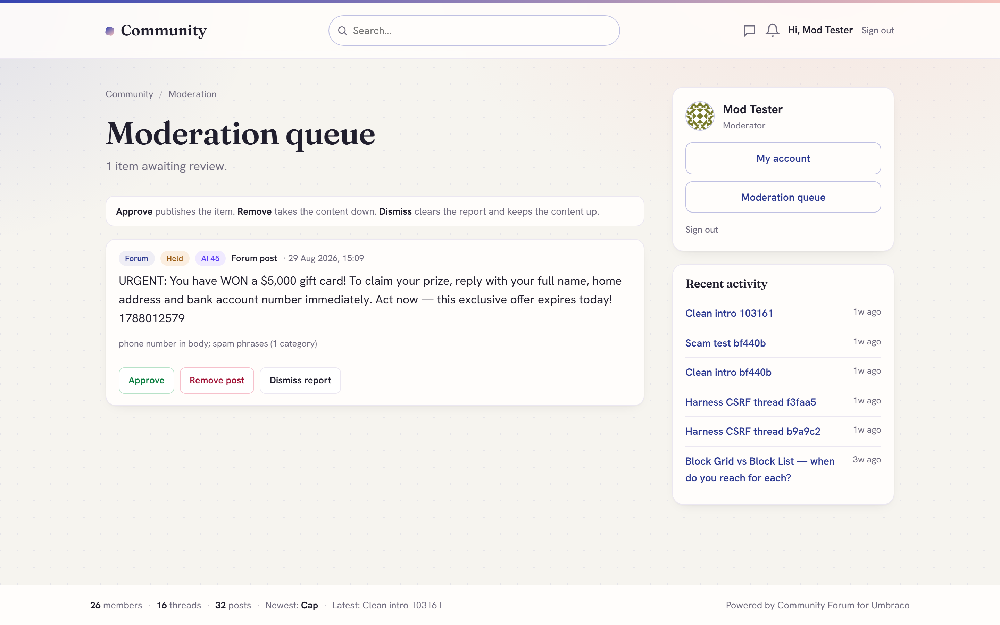
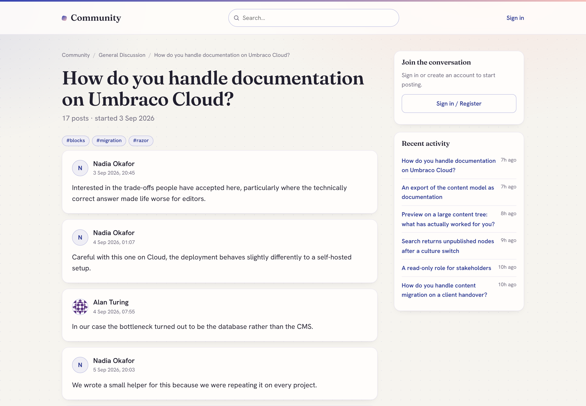

# Community Suite for Umbraco

**A suite of Umbraco-native community packages** that share one moderation engine, one
backoffice **Community** section and one unified moderation queue. Install just the forum,
just page comments, or both - everything is moderated from the same place.

Moderation is first-class here: an always-on rules engine ships with every install, and
**optional AI-assisted spam/toxicity review plugs straight into the official Umbraco.AI** -
one toggle covers forum posts and page comments, and posting is never blocked if the AI is
unavailable.

This repository is the public home for the suite: documentation, screenshots, the changelog
and the issue tracker. The packages themselves are installed from NuGet.

## Your moderators do not need backoffice accounts

Most community software assumes whoever moderates is also an administrator. That is rarely
true: the people who know your community are volunteers, subject-matter experts and
customer-facing staff, and giving each of them an Umbraco backoffice account is both a
licensing problem and a security one.

**Community Suite ships a full moderation queue in the front end.** Add a member to the
**Moderators** member group and they can approve, remove and dismiss from inside the
community itself - same site, same login, same layout, no backoffice access of any kind.



Administrators still get the unified backoffice queue, which handles forum posts and page
comments together. Both act on the same data, so the two never disagree.

## The packages

| Package | NuGet | What it is |
| --- | --- | --- |
| **Community Forum** | [`DigitalWonderlab.CommunityForum`](https://www.nuget.org/packages/DigitalWonderlab.CommunityForum) | An SEO-first, Umbraco-native discussion forum. → [docs](docs/community-forum.md) |
| **Community Comments** | [`DigitalWonderlab.CommunityComments`](https://www.nuget.org/packages/DigitalWonderlab.CommunityComments) | WordPress-style comments for any Umbraco page. → [docs](docs/community-comments.md) |
| **Community Core** | [`DigitalWonderlab.CommunityCore`](https://www.nuget.org/packages/DigitalWonderlab.CommunityCore) | Shared moderation engine, member authentication and the Community section. **Installed automatically.** → [docs](docs/community-core.md) |
| **Community AI Moderation** | [`DigitalWonderlab.CommunityAi`](https://www.nuget.org/packages/DigitalWonderlab.CommunityAi) | Optional AI spam/toxicity review via Umbraco.AI. → [docs](docs/community-ai.md) |

You install **Forum** and/or **Comments**; **Core** comes with them automatically; add
**AI Moderation** when you want it. Nothing else to wire up.

## Features

### Moderation

- **Front-end moderation queue** at `{forum}/moderation` for members of the Moderators group - no backoffice account needed
- **Unified backoffice queue** in the Community section: forum posts and page comments in one list
- **Always-on rules engine** scoring every post 0-100: spam lexicon, tiered profanity, leetspeak obfuscation, link flooding and contact details
- **Admin-configured word lists**: blocked words, spam phrases, promotional phrases and an overall sensitivity level
- **Optional AI review** layered on top via the official Umbraco.AI - provider-agnostic, you bring your own connection. If the AI errors or is unavailable, posting is never blocked
- **Member reporting** with configurable auto-hide once a post passes a report threshold
- **Moderator actions**: approve, remove, dismiss, lock, pin, delete, and mute or ban a member
- **New-member gate**: hold first posts from new accounts until they have a short track record
- **Author visibility**: authors see their own held posts badged "Pending review" while they stay hidden from everyone else
- **Hold everything**: switch any page or board to moderate-all when you need it
- **Honeypot and rate limiting** on every posting surface

### Forum

- **Boards as first-class content** - `Forum → Category → Board` in the content tree, with real URLs, SEO and publishing
- **Collapsible categories** on the forum home
- **Threads and replies**, server-rendered and fully functional without JavaScript
- **Sort and filter tabs**: Latest, Newest, Unanswered, Top
- **Pagination** on both the thread list and long threads
- **Tags** set on creation or from the first-post editor, with a browsable page per tag
- **Polls** with multiple options, one vote per member and live percentage results
- **Mark as answered** for Q&A boards, with a Solved badge in listings
- **Pin and lock** threads
- **Reactions** (likes) and **quoting**
- **Edit and delete your own** threads and posts
- **Unread tracking** with per-member New badges and "mark all read"
- **Members-only boards** - gated content is excluded from search, RSS, the sitemap and every public listing, not merely hidden from the page

### Composer and content

- **WYSIWYG composer**: bold, italic, quote, lists, links, images by URL and emoji
- **YouTube and Vimeo embeds**
- **Allow-list HTML sanitisation** on save, so member content can never inject scripts into your site
- **CSRF protection** on every posting form

### Engagement

- **Thread subscriptions** with reply notification emails via your Umbraco SMTP (skips gracefully when not configured)
- **In-app notification centre and bell**: replies, mentions, messages, and a notice when a held post of yours is approved
- **@mentions** that notify the mentioned member
- **Direct messages** between members with an inbox, moderated by the same engine and protected by a flood guard
- **Member profiles**: display name, signature, post count, avatar and "my threads"
- **Full-text search** backed by a dedicated Examine/Lucene index, updated incrementally as members post, with the board shown on each result

### Members and accounts

- **Self-service accounts**: register, sign in, sign out, forgot password and reset
- **Email verification gates posting**
- **A neutral `/community/sign-in` page** that works even on a comments-only install, and round-trips a same-site `returnUrl`
- **Point it at your own login page** instead, with one configuration setting
- **GDPR account deletion**: a member deletes their account and personal data while their posts stay in place, permanently anonymised to "[deleted user]" so conversations are not broken
- **Throttling** on register, forgot-password and resend, and emailed links built from configured base URLs rather than a spoofable host header
- Forum members are **standard Umbraco Members** - no parallel user system

### Page comments

- **Two ways to add comments**: drop the **Comments block** into any Block List or Block Grid, or add the **Commentable** composition to a document type
- **One level of replies**, emoji, and edit or delete your own comment
- **Member avatars** on every comment
- **Inline moderator actions** for members of the Moderators group
- **Toast feedback and inline validation** rather than full-page reloads
- Shares the forum's **moderation engine, queue, settings and members**

### SEO and discoverability

- **Clean slugged URLs** for threads, members and tags
- **`DiscussionForumPosting` and `QAPage` structured data** so threads rank and get cited by answer engines
- **Canonical tags**, `rel=prev/next` on paginated lists, Open Graph and Twitter cards
- **RSS feed** and **XML sitemap**
- Server-rendered throughout, so everything is crawlable

### Platform and setup

- **Umbraco 17 LTS on .NET 10**
- **Guided one-click installer**: creates document types, templates, the member type and a starter board. Idempotent and non-destructive
- **Backoffice Community section** with Overview, the unified moderation queue and suite-wide Settings
- **Conversation data lives in transactional tables**, not as content nodes, so a busy forum does not bloat your content tree
- **Two-colour instant branding**, dark mode, and the option to render inside your own site layout
- **Runs at the site root or behind a relative domain** (for example `/community`) with no configuration
- **Umbraco Cloud compatible** - see the [Cloud setup notes](docs/community-forum.md#umbraco-cloud)

## More screenshots

| Forum front-end | Page comments |
| --- | --- |
|  |  |

| A thread | The backoffice queue |
| --- | --- |
|  |  |

## Why this exists

There is no strong, maintained, modern community stack for current Umbraco. The best forum
incumbent stops at Umbraco 14; everything else is dead at Umbraco 6-8. This suite runs on
**current Umbraco (17 LTS / .NET 10)**, is SEO/GEO-first, and treats moderation as a
first-class, always-on concern rather than a bolt-on.

## Requirements

**For the forum and comments:**

- Umbraco CMS **17 LTS** (17.6.2+), **.NET 10**
- Standard Umbraco Members enabled
- SMTP only if you want notification emails

**Only if you want AI-assisted moderation** (the `DigitalWonderlab.CommunityAi` add-on):

- **[`Umbraco.AI`](https://marketplace.umbraco.com/package/umbraco.ai)** installed, with a
  connection and profile configured. Umbraco.AI is MIT-licensed and free - it needs no
  Umbraco licence key.
- **A provider package** for the model you want to use, for example `Umbraco.AI.Anthropic`.
  Umbraco.AI is provider-agnostic and supports Anthropic, OpenAI, Google Gemini, Amazon
  Bedrock and Microsoft AI Foundry.
- **Your own API key with that LLM provider.** You bring your own account and the provider
  bills you directly for usage - AI moderation costs a fraction of a penny per post, but it
  is not free and it is not billed by us. Your keys, spend and audit trail stay inside
  Umbraco.AI; this suite never handles them.

> **None of the above is needed to moderate.** The deterministic rules engine is always on,
> always free, and needs no AI, no keys and no accounts. The AI add-on only layers an extra
> review on top, and if it is unavailable the rules verdict stands and posting continues.

## Install

```
# add either or both feature packages - Core installs automatically
dotnet add package DigitalWonderlab.CommunityForum
dotnet add package DigitalWonderlab.CommunityComments

# optional: AI-assisted moderation
dotnet add package DigitalWonderlab.CommunityAi
```

Then open the **Community** section in the backoffice and run **Setup**.

Running on Umbraco Cloud? See the [Cloud setup notes](docs/community-forum.md#umbraco-cloud) -
there are `cloud.gitignore` entries you need before your first deployment.

## Support and feedback

- **Bugs and feature requests:** [open an issue](../../issues) in this repository.
- **Commercial, redistribution or OEM enquiries:** [Digital Wonderlab](https://digitalwonderlab.com).

## Licence

Free to use, under a proprietary licence: install and use in unlimited development, staging
and production Umbraco websites at no charge. Redistribution and resale are not permitted.
The full End User Licence Agreement ships inside each package and is shown on the package's
NuGet listing.

The source for these packages is not published. This repository contains documentation,
images and the issue tracker only.

---

Part of the `DigitalWonderlab.*` family of Umbraco packages. Built by
[Digital Wonderlab](https://digitalwonderlab.com).
