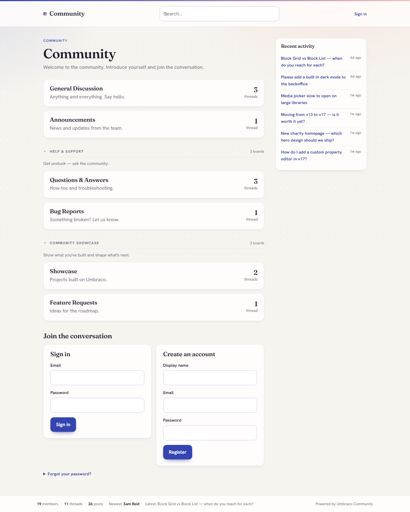
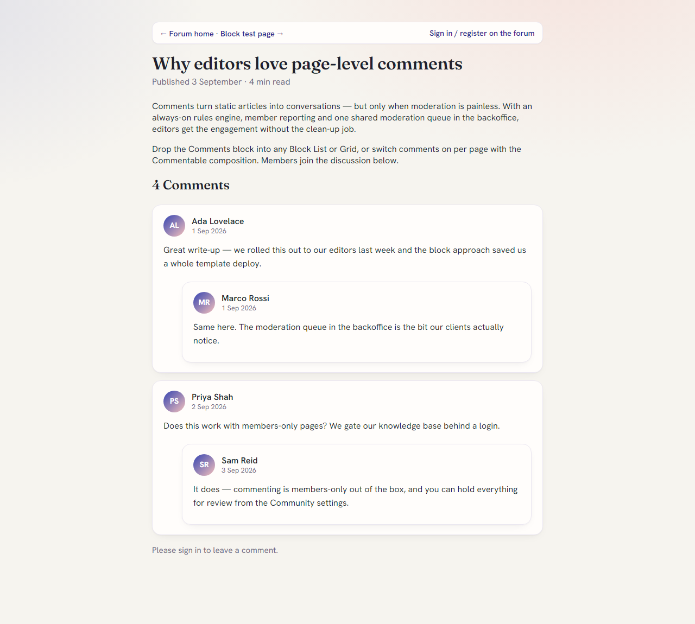
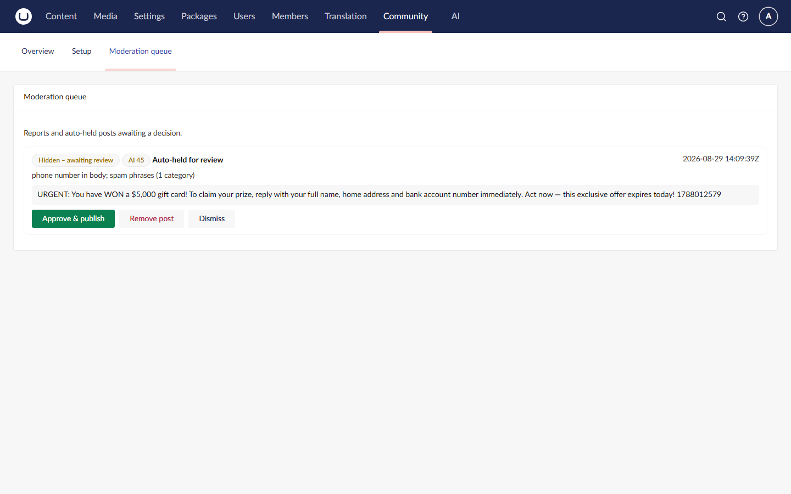

# Community Suite for Umbraco

**A suite of Umbraco-native community packages** that share one moderation engine, one
backoffice **Community** section and one unified moderation queue. Install just the forum,
just page comments, or both - everything is moderated from the same place.

Moderation is first-class here: an always-on rules engine ships with every install, and
**optional AI-assisted spam/toxicity review plugs straight into the official Umbraco.AI** -
one toggle covers forum posts and page comments, and posting is never blocked if the AI is
unavailable. Moderators can work from the backoffice queue or from a front-end queue inside
the community itself, so volunteer moderators never need a backoffice account.

This repository is the public home for the suite: documentation, screenshots, the changelog
and the issue tracker. The packages themselves are installed from NuGet.

## The packages

| Package | NuGet | What it is |
| --- | --- | --- |
| **Community Forum** | [`DigitalWonderlab.CommunityForum`](https://www.nuget.org/packages/DigitalWonderlab.CommunityForum) | An SEO-first, Umbraco-native discussion forum. → [docs](docs/community-forum.md) |
| **Community Comments** | [`DigitalWonderlab.CommunityComments`](https://www.nuget.org/packages/DigitalWonderlab.CommunityComments) | WordPress-style comments for any Umbraco page. → [docs](docs/community-comments.md) |
| **Community Core** | [`DigitalWonderlab.CommunityCore`](https://www.nuget.org/packages/DigitalWonderlab.CommunityCore) | Shared moderation engine, member authentication and the Community section. **Installed automatically.** → [docs](docs/community-core.md) |
| **Community AI Moderation** | [`DigitalWonderlab.CommunityAi`](https://www.nuget.org/packages/DigitalWonderlab.CommunityAi) | Optional AI spam/toxicity review via Umbraco.AI. → [docs](docs/community-ai.md) |

You install **Forum** and/or **Comments**; **Core** comes with them automatically; add
**AI Moderation** when you want it. Nothing else to wire up.

## Screenshots

| Forum front-end | Page comments |
| --- | --- |
|  |  |

The shared moderation queue handles forum posts and page comments in one list:



## Why this exists

There is no strong, maintained, modern community stack for current Umbraco. The best forum
incumbent stops at Umbraco 14; everything else is dead at Umbraco 6-8. This suite runs on
**current Umbraco (17 LTS / .NET 10)**, is SEO/GEO-first, and treats moderation as a
first-class, always-on concern rather than a bolt-on.

## Requirements

- Umbraco CMS **17 LTS** (17.6.2+), **.NET 10**
- Standard Umbraco Members enabled
- SMTP only if you want notification emails

## Install

```
# add either or both feature packages - Core installs automatically
dotnet add package DigitalWonderlab.CommunityForum
dotnet add package DigitalWonderlab.CommunityComments

# optional: AI-assisted moderation
dotnet add package DigitalWonderlab.CommunityAi
```

Then open the **Community** section in the backoffice and run **Setup**.

Running on Umbraco Cloud? See the [Cloud setup notes](docs/community-forum.md#umbraco-cloud) -
there are `cloud.gitignore` entries you need before your first deployment.

## Support and feedback

- **Bugs and feature requests:** [open an issue](../../issues) in this repository.
- **Commercial, redistribution or OEM enquiries:** [Digital Wonderlab](https://digitalwonderlab.com).

## Licence

Free to use, under a proprietary licence: install and use in unlimited development, staging
and production Umbraco websites at no charge. Redistribution and resale are not permitted.
The full End User Licence Agreement ships inside each package and is shown on the package's
NuGet listing.

The source for these packages is not published. This repository contains documentation,
images and the issue tracker only.

---

Part of the `DigitalWonderlab.*` family of Umbraco packages. Built by
[Digital Wonderlab](https://digitalwonderlab.com).
