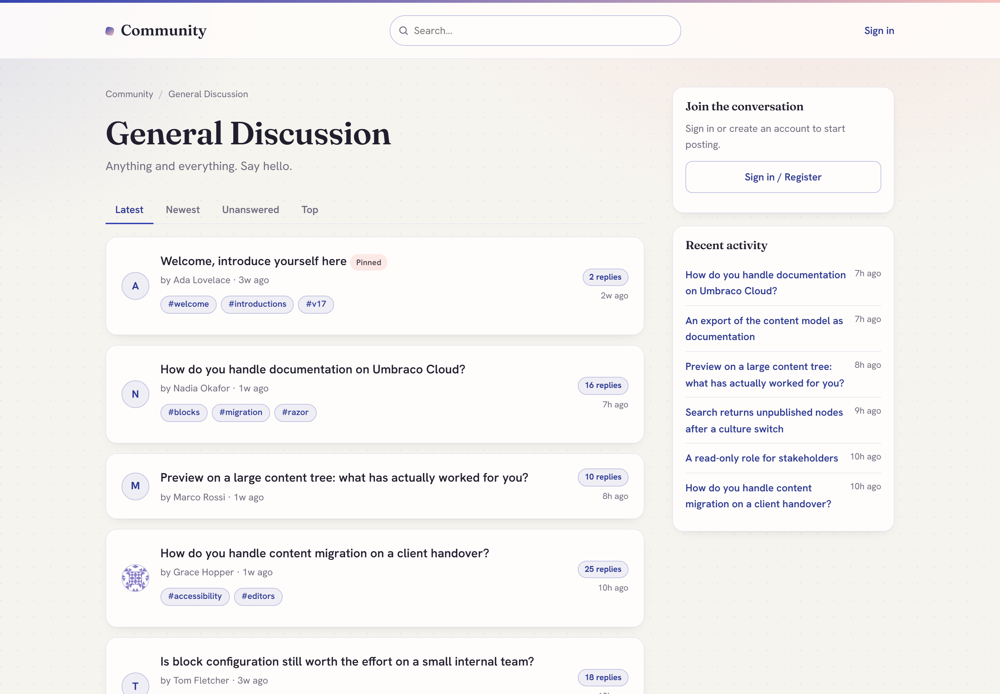

# Community Suite for Umbraco

**A suite of Umbraco-native community packages** that share one moderation engine, one
backoffice **Community** section and one unified moderation queue. Install just the forum,
just page comments, or both - everything is moderated from the same place.

Every install ships a deterministic rules engine that runs on every submission. An optional
add-on layers AI review on top via the official Umbraco.AI, covering forum posts and page
comments from one setting. If the AI errors or does not answer within 8 seconds, the rules
verdict stands and the submission continues on that basis.

This repository is the public home for the suite: documentation, screenshots, the changelog
and the issue tracker. The packages themselves are installed from NuGet.


## Your moderators do not need backoffice accounts

Most community software assumes whoever moderates is also an administrator. That is rarely
true: the people who know your community are volunteers, subject-matter experts and
customer-facing staff, and giving each of them an Umbraco backoffice account is both a
licensing problem and a security one.

**Community Suite ships a full moderation queue in the front end.** Add a member to the
**Moderators** member group and they can approve, remove and dismiss from inside the
community itself - same site, same login, same layout, no backoffice access of any kind.


Administrators still get the unified backoffice queue, which handles forum posts and page
comments together. Both act on the same data, so the two never disagree.

## The packages

| Package | NuGet | What it is |
| --- | --- | --- |
| **Community Forum** | [`DigitalWonderlab.CommunityForum`](https://www.nuget.org/packages/DigitalWonderlab.CommunityForum) | An SEO-first, Umbraco-native discussion forum. → [docs](docs/community-forum.md) |
| **Community Comments** | [`DigitalWonderlab.CommunityComments`](https://www.nuget.org/packages/DigitalWonderlab.CommunityComments) | WordPress-style comments for any Umbraco page. → [docs](docs/community-comments.md) |
| **Community Core** | [`DigitalWonderlab.CommunityCore`](https://www.nuget.org/packages/DigitalWonderlab.CommunityCore) | Shared moderation engine, member authentication and the Community section. **Installed automatically.** → [docs](docs/community-core.md) |
| **Community AI Moderation** | [`DigitalWonderlab.CommunityAi`](https://www.nuget.org/packages/DigitalWonderlab.CommunityAi) | Optional AI spam/toxicity review via Umbraco.AI. → [docs](docs/community-ai.md) |

You install **Forum** and/or **Comments**; **Core** comes with them automatically; add
**AI Moderation** when you want it. Beyond running the installer, a production site needs a
canonical base URL set (see [Requirements](#requirements)); AI moderation needs Umbraco.AI
configured, and a comments-only site needs a way for members to register, which the forum
would otherwise provide.

## Features

### Moderation

- **Front-end moderation queue** at `{forum}/moderation` for members of the Moderators group - no backoffice account needed
- **Unified backoffice queue** in the Community section: forum posts and page comments in one list
- **Always-on rules engine** scoring every post 0-100: spam lexicon, tiered profanity, leetspeak obfuscation, link flooding and contact details
- **Admin-configured word lists**: blocked words, spam phrases, promotional phrases and an overall sensitivity level
- **Optional AI review** layered on top via the official Umbraco.AI - provider-agnostic, you bring your own connection. If the AI errors, is unavailable or does not answer within 8 seconds, the rules verdict stands
- **Member reporting** with configurable auto-hide once a post passes a report threshold
- **Moderator actions**: approve, remove, dismiss, lock, pin, delete, and mute or ban a member
- **New-member gate**: hold first posts from new accounts until they have a short track record
- **Author visibility**: authors see their own held posts badged "Pending review" while they stay hidden from everyone else
- **Hold everything**: switch any page or board to moderate-all when you need it
- **Honeypot and rate limiting** on every posting surface

### Forum

- **Boards as first-class content** - `Forum → Category → Board` in the content tree, with real URLs, SEO and publishing
- **Collapsible categories** on the forum home
- **Threads and replies**, server-rendered and fully functional without JavaScript
- **Sort and filter tabs**: Latest, Newest, Unanswered, Top
- **Pagination** on both the thread list and long threads
- **Tags** set on creation or from the first-post editor, with a browsable page per tag
- **Polls** with multiple options, one vote per member and live percentage results
- **Mark as answered** for Q&A boards, with a Solved badge in listings
- **Pin and lock** threads
- **Reactions** (likes) and **quoting**
- **Edit and delete your own** threads and posts
- **Unread tracking** with per-member New badges and "mark all read"
- **Members-only boards** - gated content is excluded from search, RSS, the sitemap and every public listing, not merely hidden from the page

### Composer and content

- **WYSIWYG composer**: bold, italic, quote, lists, links, images by URL and emoji
- **YouTube and Vimeo embeds**
- **Allow-list HTML sanitisation** on save: member markup is reduced to a fixed set of safe tags and attributes before it is stored
- **CSRF protection** on every posting form

### Engagement

- **Thread subscriptions** with reply notification emails via your Umbraco SMTP (skips gracefully when not configured)
- **In-app notification centre and bell**: replies, mentions, messages, and a notice when a held post of yours is approved
- **@mentions** that notify the mentioned member
- **Direct messages** between members with an inbox. Senders must have a verified email and an unrestricted profile (banned and muted members cannot send), and a flood guard caps the rate. DMs are private, so they are **not** passed through the moderation rules engine, and v1 has no recipient-side block or report: see [Limitations](#limitations)
- **Member profiles**: display name, signature, post count, avatar and "my threads"
- **Full-text search** backed by a dedicated Examine/Lucene index, updated incrementally as members post, with the board shown on each result

### Members and accounts

- **Self-service accounts**: register, sign in, sign out, forgot password and reset
- **Email verification gates posting** in the forum (page comments require a signed-in member, not a verified one)
- **A neutral `/community/sign-in` page** that works even on a comments-only install, and round-trips a same-site `returnUrl`
- **Point it at your own login page** instead, with one configuration setting
- **Account deletion covering every installed package**: a member deletes their own account and the Umbraco member record goes. Their forum threads and posts, and their page comments, stay in place so conversations are not broken, stripped of anything identifying and shown as "[deleted user]". Their subscriptions, notifications, reactions, poll votes, read state and direct messages are deleted outright. A site running comments without the forum can call the same erasure service from its own account flow
- **Throttling** on register, forgot-password and resend. Links that carry a security token (password reset, email verification) are built only from a canonical base URL, or from a host that ASP.NET Core host filtering has already validated. If neither is available the email is not sent and the reason is logged, rather than emailing a link built from a spoofable `Host` header
- Forum members are **standard Umbraco Members** - no parallel user system

### Page comments

- **Two ways to add comments**: drop the **Comments block** into any Block List or Block Grid, or add the **Commentable** composition to a document type
- **One level of replies**, emoji, and edit or delete your own comment
- **Member avatars** on every comment
- **Inline moderator actions** for members of the Moderators group
- **Toast feedback and inline validation** rather than full-page reloads
- Shares the forum's **moderation engine, queue, settings and members**

### SEO and discoverability

- **Clean slugged URLs** for threads, members and tags
- **`DiscussionForumPosting` and `QAPage` structured data** on threads, so search and answer engines can read the discussion as a discussion
- **Canonical tags**, `rel=prev/next` on paginated lists, Open Graph and Twitter cards
- **RSS feed** and **XML sitemap**
- Server-rendered throughout, so everything is crawlable

### Platform and setup

- **Umbraco 17 LTS on .NET 10**
- **Guided one-click installer**: creates document types, templates, the member type and a starter board. Idempotent and non-destructive
- **Backoffice Community section** with Overview, the unified moderation queue and suite-wide Settings
- **Conversation data lives in transactional tables**, not as content nodes, so a busy forum does not bloat your content tree
- **Two-colour instant branding** and dark mode, so the community picks up your palette without a theme build
- **Runs at your site root or behind a culture/domain binding**. In v1 the Forum node itself must sit at the root of the content tree: the `/search`, `/account`, `/tag`, `/member`, `/messages`, `/notifications` and `/moderation` pages are resolved from a root Forum, and will not resolve if it is nested under another page
- **Umbraco Cloud compatible** - see the [Cloud setup notes](docs/community-forum.md#umbraco-cloud)

## How it is built

The suite is deliberately split in two. **Structure is Umbraco content. Conversation is
transactional data.**

### Structure and configuration are content nodes

The installer creates four document types, and they behave like any other content:

| Document type | What it is |
| --- | --- |
| **Forum** | The root of a community. In v1 this node sits at the root of your content tree. |
| **Forum Category** | A grouping heading on the forum home. |
| **Forum Board** | Where threads live. Carries its own description, SEO fields, access level (public or members-only), whether new threads are allowed, and its moderation mode. |
| **Forum Settings** | Per-forum presentation: logo, and whether to inherit a host master template. Suite-wide behaviour (colours, AI moderation on/off, which AI profile, notification emails on/off, word lists) lives in the backoffice under **Community > Settings**, not here. |

Because they are content nodes, you get the whole of Umbraco for free: real URLs and
routing, the publishing workflow, SEO fields, per-node permissions, and the editors you
already know. Adding a board is creating a page. Rebranding the community is editing a
content node. And because they are schema plus content, they move between environments
through Umbraco Deploy or uSync exactly like the rest of your site.

### Conversations are transactional database tables

Everything members generate is written to the package's own tables, not the content tree:

- **Forum:** `fmThread`, `fmPost`, `fmProfile`, `fmSubscription`, `fmReport`, `fmReaction`,
  `fmTag`, `fmThreadTag`, `fmThreadRead`, `fmNotification`, `fmPoll`, `fmPollOption`,
  `fmPollVote`, `fmMessage`
- **Comments:** `dwlComment`, `dwlCommentReport`

They are created automatically on boot and need no setup.

### Why this matters

**A busy forum would destroy a content tree.** This is the single biggest reason. Ten
thousand posts is a normal year for a modest community, and as content nodes that means ten
thousand nodes: an unnavigable tree for your editors, a bloated published cache, slower
publishes and startup, and a backoffice nobody wants to open. Storing conversation in its
own indexed tables keeps the content tree the size of your site's structure rather than the
size of its traffic.

**Write patterns are completely different.** Umbraco's content APIs are built for a handful
of editors making considered, versioned changes. A forum takes writes from the public on
every request, constantly. Routing those through content publishing means cache rebuilds,
notifications and Deploy artifacts on every reply.

**Your environments stay clean.** Content flows between Umbraco environments. Member
conversations should not. Because threads and posts live in their own tables, production
discussion does not sync back into your development environment, and a content deployment
does not carry your members' posts with it.

**The queries are the right shape.** "The latest 25 threads in this board, ordered by last
reply, excluding held posts, but including this viewer's own pending thread" is one indexed
SQL query. Over content nodes it is a load-everything-and-filter-in-memory problem.

**Deleting a member is surgical.** Erasure is a targeted update across a few tables, not a
mass re-publish of thousands of nodes.

**And members are just Umbraco Members.** No parallel user store, no second login. Your
existing members can post on day one, the Moderators group is an ordinary member group,
and any members-only logic you already have keeps working.

The result: Umbraco-native where Umbraco is strong, and a proper transactional store where
Umbraco was never meant to go.

## More screenshots

| A board listing | A thread |
| --- | --- |
|  |  |

| The unified backoffice moderation queue |
| --- |
|  |

## Why this exists

We wanted a forum and page comments for Umbraco 17 that were server-rendered, moderated out
of the box, and that did not put every post in the content tree. This suite is what we built
for that, and it is maintained against current Umbraco (17 LTS / .NET 10).

## Limitations

Worth knowing before you install. These are v1 boundaries, not defects:

- **The Forum node must be at the root of the content tree.** Its virtual pages do not
  resolve from a nested Forum. One Forum per installation is the supported shape.
- **Page comments are single-culture.** A comment is stored without a culture, so every
  language variant of a page shares one conversation.
- **Direct messages are not moderated** and have no recipient-side block or report in v1.
  Banned and muted members cannot send, and a flood guard caps the rate.
- **The front-end moderation queue covers forum posts only.** Page comments are moderated
  inline on the page by members of the Moderators group, or from the backoffice queue, which
  covers both.
- **Suite settings are cached per process** and a change is picked up by the server that
  made it. On a load-balanced or multi-instance setup the other instances keep the previous
  values until they recycle.
- **Not everything is paged yet.** A page's comments and a member's inbox are loaded in
  full. That is comfortable at the scale a single page's discussion reaches, and is on the
  list to page before it is not.

## Requirements

**For the forum and comments:**

- Umbraco CMS **17 LTS** (17.6.2+), **.NET 10**
- Standard Umbraco Members enabled
- SMTP only if you want notification emails
- On production, either `Community:Auth:BaseUrl` set to your site's public URL (for example
  `https://example.com`), or ASP.NET Core `AllowedHosts` set to a real allow-list. Password
  reset and email verification will not send without one of the two, because the link they
  carry would otherwise be built from an unvalidated `Host` header

**Only if you want AI-assisted moderation** (the `DigitalWonderlab.CommunityAi` add-on):

- **[`Umbraco.AI`](https://marketplace.umbraco.com/package/umbraco.ai)** installed, with a
  connection and profile configured. Umbraco.AI is MIT-licensed and free - it needs no
  Umbraco licence key.
- **A provider package** for the model you want to use, for example `Umbraco.AI.Anthropic`.
  Umbraco.AI is provider-agnostic and supports Anthropic, OpenAI, Google Gemini, Amazon
  Bedrock and Microsoft AI Foundry.
- **Your own API key with that LLM provider.** You bring your own account and the provider
  bills you directly for usage. It is not free and it is not billed by us; what it costs
  depends on the model and the volume you choose. Your keys, spend and audit trail stay
  inside Umbraco.AI, and this suite does not handle them.

> **None of the above is needed to moderate.** The deterministic rules engine is always on,
> always free, and needs no AI, no keys and no accounts. The AI add-on only layers an extra
> review on top; if it errors or does not answer within 8 seconds, the rules verdict stands.

## Install

```
# add either or both feature packages - Core installs automatically
dotnet add package DigitalWonderlab.CommunityForum
dotnet add package DigitalWonderlab.CommunityComments

# optional: AI-assisted moderation
dotnet add package DigitalWonderlab.CommunityAi
```

Then open the **Community** section in the backoffice and run **Setup**.

Running on Umbraco Cloud? See the [Cloud setup notes](docs/community-forum.md#umbraco-cloud) -
there are `cloud.gitignore` entries you need before your first deployment.

## Support and feedback

- **Bugs and feature requests:** [open an issue](../../issues) in this repository.
- **Commercial, redistribution or OEM enquiries:** [Digital Wonderlab](https://digitalwonderlab.com).

## Licence

Free to use, under a proprietary licence: install and use in unlimited development, staging
and production Umbraco websites at no charge. Redistribution and resale are not permitted.
The full End User Licence Agreement ships inside each package and is shown on the package's
NuGet listing.

The source for these packages is not published. This repository contains documentation,
images and the issue tracker only.

---

Part of the `DigitalWonderlab.*` family of Umbraco packages. Built by
[Digital Wonderlab](https://digitalwonderlab.com).
