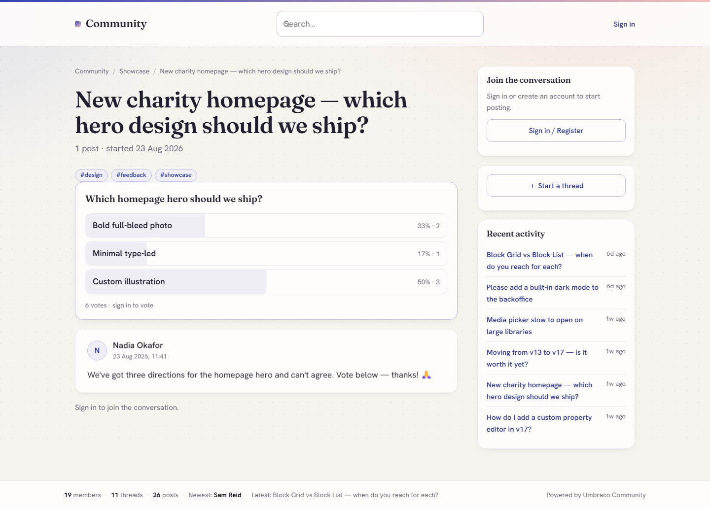
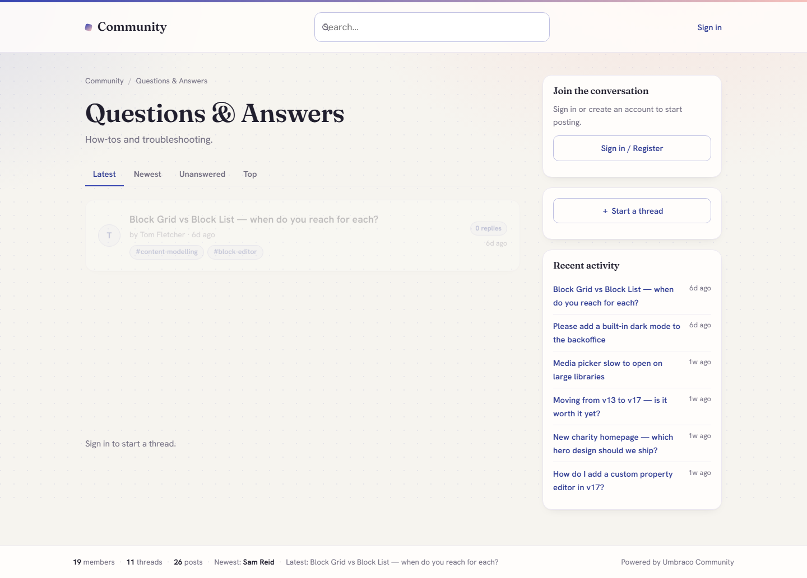

# Community Forum for Umbraco

**An Umbraco-native discussion forum.** Members start threads and reply on the
front-end, moderators work either from the front-end or the backoffice, and the whole
thing lives inside a standard Umbraco site with no separate app to run.

Boards are first-class Umbraco content; threads, posts, reports and profiles live
in the package's own transactional tables. The front-end re-skins from two brand
colours, is server-rendered (so it is fully crawlable), and ships with the SEO and
structured-data markup that turns a forum into an organic-growth asset rather than
a support cost.

> **Free to use.** The whole forum is free - see the licence below. Every install
> moderates with an always-on rules engine; **optional AI-assisted spam/toxicity
> review integrates with the official Umbraco.AI** and layers on top when you want it.

> Part of the **Community for Umbraco** suite. See the
> [suite overview](https://github.com/dwlgit/community-suite) for page comments, the shared
> moderation core, and the AI add-on.

## Screenshots


| Threads & replies | Polls |
| --- | --- |
|  |  |

| Q&A boards | Backoffice moderation queue |
| --- | --- |
|  |  |

## Your moderators do not need backoffice accounts

The people who know your community are usually volunteers, subject-matter experts and
customer-facing staff, not administrators. Giving each of them an Umbraco backoffice
account is both a licensing problem and a security one.

So the forum ships a **full moderation queue in the front end**. Add a member to the
**Moderators** member group and they can approve, remove and dismiss from inside the
community itself, at `{forum}/moderation` - same site, same login, same layout, no
backoffice access of any kind. Administrators still get the unified backoffice queue,
which covers forum posts and page comments together. Both act on the same data.


## Why this exists

There is no strong, maintained, modern forum package for current Umbraco. The
best incumbent stops at Umbraco 14; everything else is dead at Umbraco 6-8. A site
on current Umbraco that wants a community forum has had no good native option,
until now.

## What makes it different

- **Runs on current Umbraco (17 / .NET 10).** The feature-competitive incumbents
  do not.
- **AI-assisted moderation, built on the official Umbraco.AI.** An optional add-on
  layers AI spam/toxicity review on top of the always-on rules engine - provider-
  agnostic (you bring your own Umbraco.AI connection and keys), covering forum posts
  and page comments with one toggle. No incumbent forum package integrates with
  Umbraco.AI like this.
- **Safe by design.** Every post is sanitised on save; a built-in moderation rules
  engine and a real moderation queue are on from day one - with or without the AI add-on.
- **SEO / GEO first.** Clean URLs and `DiscussionForumPosting` / `QAPage`
  structured data so threads rank and get cited by answer engines. A forum is a
  long-tail content factory, and it is built as one.
- **Two-colour instant branding** and dark mode, so the forum picks up your palette
  without a theme build.

## How it is built

The forum is deliberately split in two: **structure is Umbraco content, conversation is
transactional data.**

**Structure and configuration are content nodes.** The installer creates four document
types - **Forum** (the root), **Forum Category** (a grouping), **Forum Board** (where
threads live, carrying its own description, SEO fields, access level, new-thread and
moderation settings) and **Forum Settings** (branding and behaviour). Because they are
ordinary content, you get real URLs and routing, the publishing workflow, SEO fields and
per-node permissions for free, you manage them in the editor you already know, and they
move between environments through Umbraco Deploy or uSync like the rest of your site.

**Conversation lives in the package's own tables** - `fmThread`, `fmPost`, `fmProfile`,
`fmSubscription`, `fmReport`, `fmReaction`, `fmTag`, `fmThreadTag`, `fmThreadRead`,
`fmNotification`, `fmPoll`, `fmPollOption`, `fmPollVote` and `fmMessage` - created
automatically on boot.

That split is the point:

- **A busy forum would destroy a content tree.** Ten thousand posts is a normal year for a
  modest community. As content nodes that is an unnavigable tree, a bloated published
  cache, slower publishes and a backoffice nobody wants to open. The best-known existing
  Umbraco forum package stores every post as a content node, and that is where it runs out
  of road. This stays flat and indexed however much people talk.
- **The write patterns are different.** Umbraco's content APIs are built for a few editors
  making considered, versioned changes; a forum takes public writes on every request.
- **Your environments stay clean.** Production conversation never syncs back into your
  development environment, and a deployment can never overwrite what members wrote
  last night.
- **The queries are the right shape.** "Latest 25 threads in this board by last reply,
  excluding held posts, plus this viewer's own pending thread" is one indexed SQL query.
- **Deleting a member is surgical** - a targeted update across a few tables, not a mass
  re-publish.
- **Members are just Umbraco Members.** No parallel user store, no second login, and the
  Moderators group is an ordinary member group.

## Features

### Structure and content

- **Boards as content** - `Forum → Category → Board` in the Umbraco content tree,
  with real URLs, SEO and publishing. Categories collapse on the forum home.
- **Threads and replies** - logged-in members post on the server-rendered
  front-end; works without JavaScript and is fully crawlable.
- **Sort and filter** - Latest / Newest / Unanswered / Top tabs on every board,
  with pagination on both the thread list and long threads.
- **Tags** - tag a thread on creation or from the first-post editor, with a
  browsable page per tag.
- **Polls** - add a multi-option poll to a thread; one vote per member, live
  results with percentages.
- **Gated boards** - make a board members-only; gated content is excluded from
  search, RSS, the sitemap and all public listings, not just hidden from the page.

### Posting and engagement

- **WYSIWYG composer** - bold, italic, quote, lists, links, images by URL, emoji,
  and YouTube / Vimeo embeds.
- **Safe posts** - every post sanitised on save against an allow-list, so user
  content can never inject scripts into your site.
- **Reactions, quoting and editing** - like a post, quote a reply, edit or delete
  your own posts.
- **Mark as answered** - Q&A-style boards can flag the accepted answer, and
  answered threads carry a Solved badge in listings.
- **Unread tracking** - new threads and replies are badged per member, with
  "mark all read".
- **@mentions** - mention a member and they get notified.
- **Direct messages** - member-to-member private messages with an inbox, moderated
  by the same engine and protected by a flood guard.
- **Notifications** - an in-app notification centre and bell (replies, mentions,
  messages, and a notice when a held post of yours is approved), plus optional
  **reply notification emails** (uses your Umbraco SMTP; skips gracefully if not
  configured).
- **Search** - full-text thread search backed by a custom Examine/Lucene index,
  incrementally updated as members post.

### Members and accounts

- **Member profiles** - display name, signature, post count, avatar, "my threads".
  Forum users are standard Umbraco Members.
- **Self-service accounts** - register, sign in, sign out, forgot / reset password,
  and a My Account page. **Email verification gates posting.** Provided by the
  shared Core, so a neutral `/community/sign-in` page works even on a comments-only
  install.
- **GDPR account deletion** - a member can delete their account and personal data
  (profile, messages, notifications, subscriptions) while their posts stay in place,
  permanently anonymised to "[deleted user]" so conversations are not broken.

### Moderation

- **Two ways to moderate.** A **front-end moderation queue** at `{forum}/moderation`
  for members of the Moderators group (no backoffice account needed), rendered inside
  your community layout, and the unified **backoffice queue** in the Community section.
- **Moderator actions** - report a post; lock, pin or delete a thread; edit or remove
  a post; mute or ban a member; approve, remove or dismiss from either queue.
- **Always-on rules engine** - spam, profanity, links, contact details and obfuscation
  scoring, honeypot and rate limiting, with admin-configured **blocked words, spam
  phrases, promotional phrases and a sensitivity level** in Community → Settings.
- **New-member gate** - hold first posts from new accounts until they have a short
  track record, configurable per install.
- **Author visibility** - authors can see their own held posts and threads (clearly
  badged "Pending review") while they stay hidden from everyone else.
- **Optional AI review** - add `DigitalWonderlab.CommunityAi` to layer Umbraco.AI
  spam/toxicity review on top. An AI outage never blocks posting.

### SEO and setup

- **SEO built in** - clean slugged URLs, canonical tags, `rel=prev/next` on paginated
  thread lists, Open Graph / Twitter cards, RSS, an XML sitemap, and
  `DiscussionForumPosting` / `QAPage` structured data.
- **Backoffice Community section** - Overview, a unified **Moderation queue** (forum
  posts and, if installed, page comments in one list), suite-wide **Settings**, and a
  guided Setup.
- **One-click installer** - the Setup dashboard creates the document types,
  templates, member type and a starter board. Idempotent and non-destructive.
- **Runs behind any domain** - works at the site root or under a relative domain
  (for example `/community`) with no configuration.

### Add page comments to the rest of your site

The forum shares its moderation engine, queue and settings with
[`DigitalWonderlab.CommunityComments`](https://www.nuget.org/packages/DigitalWonderlab.CommunityComments),
WordPress-style comments for any Umbraco page. Install both and everything is
moderated from the same Community section.

### Optional AI moderation add-on

Install [`DigitalWonderlab.CommunityAi`](https://www.nuget.org/packages/DigitalWonderlab.CommunityAi)
to layer AI spam/toxicity review on top of the rules engine via **Umbraco.AI**
(provider-agnostic; you bring your own connection/profile and keys). Without it,
the forum still moderates with the deterministic rules engine.

## Requirements

- Umbraco CMS **17 LTS** (17.6.2+), **.NET 10**
- Standard Umbraco Members enabled
- SMTP only if you want notification emails

## Install

```
dotnet add package DigitalWonderlab.CommunityForum
```

Then open the **Community** section in the backoffice and run **Setup** - it
creates the schema, templates, member type and a starter board. Author your boards
under **Content**, and members can start posting on the front-end.

## Configuration

Optional. Suite-wide settings live in the backoffice under **Community → Settings**:
brand colours, notification emails, moderation sensitivity and custom blocked/spam/
promotional word lists, and the AI moderation toggle. The **Forum Settings** content
node created by the installer holds the logo and layout-inheritance. Reply
notifications use your existing Umbraco SMTP configuration.

A few settings live in `appsettings.json` under `Community:Auth`:

```json
{
  "Community": {
    "Auth": {
      "BaseUrl": "https://example.com",
      "ResetPageUrl": "/community"
    }
  }
}
```

- `BaseUrl` (recommended in production): the canonical site origin used when building
  links that are emailed to members (password reset, verification, reply notifications).
  When unset, links are built from the incoming request's host.
- `ResetPageUrl`: where the password-reset email link lands. Defaults to the built-in
  `/community/sign-in` page; point it at the forum so resets land on your account page.

### Reserved routes

The suite registers a small number of fixed front-end routes: `/community/sign-in`,
`/community/auth/*` (login, logout, forgot/reset password), `/community/feed/*` (RSS)
and `/community/sitemap.xml`. It also serves virtual paths under the forum root
(`account`, `search`, `member`, `messages`, `notifications`, `tag`). Avoid creating
content pages at those exact paths.

## Licence

Free to use, under a proprietary licence (see the `LICENSE` file in the package):
install and use it in unlimited sites at no charge; redistribution and resale are
not permitted.

---

Part of the `DigitalWonderlab.*` family of Umbraco packages. Built by
[Digital Wonderlab](https://digitalwonderlab.com).
